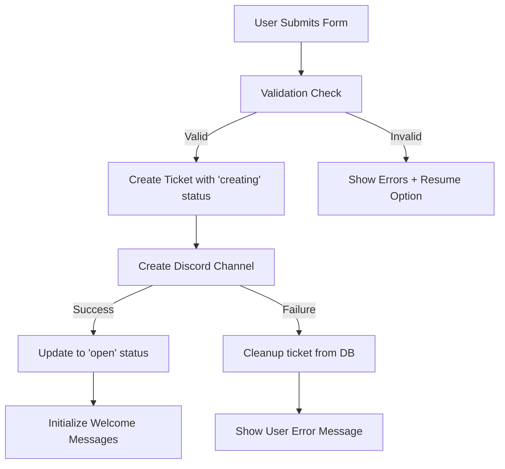
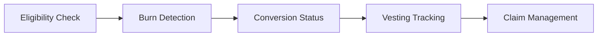

# 🧠 Project Architecture – DiscoFryBot Advanced Ticketing System

## Current System Overview
This document outlines the architecture of the **completed** and **actively running** DiscoFryBot system, which has evolved from a basic 5-category ticket system into a comprehensive support and conversion platform.

---

## Deployment Notes
- Bot code now lives under `discofrybot/ticketing-system/`; the `fry-dashboard` Next.js app is a sibling folder at repo root.
- Environment variables are injected via 1Password `op://` refs defined in `docker-compose.yml` using the `Discord Bot` vault items (`Discofrybot Secrets`, `Tickets Dash Secrets`) plus a low-sensitivity host env file at `/etc/discofrybot/.1p.env` (template in repo). Preferred command: `./scripts/op-compose.sh <cmd>` (wraps `op run --env-file /etc/discofrybot/.1p.env -- docker compose ...`).

---

## 🏗 **System Architecture**

### **Core Design Principles**
- **Modular Architecture**: Clean separation of concerns across handlers, modules, and utilities
- **Transaction Safety**: Robust ticket creation preventing orphaned tickets via "creating" → "open" status progression
- **Event-Driven**: Reactive system based on Discord interactions and automated triggers
- **Database-First**: Supabase RPC functions for complex operations and cleanup
- **Fault Tolerance**: Comprehensive error handling and automated recovery systems

### **Technology Stack**
- **Runtime**: Node.js 18+ with Discord.js v14
- **Database**: Supabase (PostgreSQL) with custom RPC functions
- **Storage**: Google Drive API for transcript archival
- **Blockchain**: Algorand API integration for FRY token operations
- **Deployment**: Docker containers with health monitoring
- **Analytics**: Built-in metrics and staff performance tracking

---

## 🎫 **Advanced Ticketing System**

### **Supported Ticket Types (9 Categories)**
1. **Order Tracking** - Order issues, shipping problems, fulfillment queries
2. **Technical Support** - Device troubleshooting, software issues, connectivity
3. **Miner Keys** - Key management, assignments, transfers, validation
4. **Rewards** - Claim issues, balance discrepancies, payout problems  
5. **Registration** - Account setup, verification, onboarding support
6. **FRY Conversion Issues** - Token conversion support, vesting, burn verification
7. **Node Forgo/Return** - Hardware returns, forgoing processes, shipping logistics
8. **Flxtime Partners Support** - Partner-specific workflows with screenshot validation
9. **General Support** - Catch-all for miscellaneous support needs

### **Smart Ticket Management**
- **One-Ticket Rule**: Users limited to one active ticket across all categories
- **Form Validation**: Advanced validation with field validation and resume functionality
- **Channel Management**: Automatic capacity monitoring (50 channels per category max)
- **Permission System**: Role-based access with intern, staff, and admin tiers

### **Transaction-Safe Creation Process**


---

## 🪙 **FRY Token Conversion System**

### **Conversion Architecture**
- **Snapshot Date**: December 1st, 2024 at 00:00 UTC (Block #44866969)
- **Conversion Ratios**: FRY 1.0 → FRY 2.0 (80:1) or FRY 1.0 → fNode (40:1) 
- **Vesting Schedule**: 12 months starting August 2025, 1/12th monthly unlock

### **Conversion Pipeline**


### **Key Features**
- **Snapshot Validation**: Multi-source FRY 1.0 holdings (held, staked, LP positions)
- **Burn Transaction Detection**: Automated detection with configurable lookback periods
- **Balance Monitoring**: Real-time FRY 1.0, ALGO, and locked balance checking
- **Unregistered Burn Detection**: Identifies burn transactions not yet in conversion database
- **Progress Tracking**: 5-stage conversion progress with detailed status messages

---

## 🤝 **Flxtime Partners Integration**

### **Specialized Workflows**
- **Screenshot Validation**: Automated detection and processing of uploaded images
- **Hardware Verification**: Serial number and factory reset confirmation
- **Reminder System**: 24-hour automated reminders for pending submissions
- **Status Tracking**: Complete audit trail from submission to resolution

### **Validation Pipeline**
1. **Initial Submission**: User uploads screenshots via ticket
2. **Automated Detection**: Bot processes and validates images
3. **Staff Review**: Manual verification by support staff
4. **Status Updates**: Real-time feedback to users
5. **Completion**: Final verification and ticket closure

---

## 🔧 **Staff Management System**

### **Role-Based Access Control**
- **Admins**: Full system access, user management, system configuration
- **Staff**: Ticket management, claiming, FAQ access, conversion support
- **Interns**: Limited access to specific ticket types (tech, miner keys, registration, rewards, conversion)

### **Claiming System**
- **Exclusive Ownership**: One staff member per ticket with unclaim protection
- **Contribution Tracking**: Automated message counting and point systems
- **Activity Logging**: Complete audit trail of staff actions
- **Performance Analytics**: Built-in metrics for staff productivity

### **Automated Features**
- **Inactivity Detection**: 24/48/72-hour escalation system
- **Auto-Closure**: Automated ticket closure after extended inactivity
- **Staff Pinging**: Escalating notifications for unresponded tickets

---

## 📊 **Database Schema**

### **Core Tables** (via Supabase)
```sql
api.tickets                    -- Primary ticket data (30+ fields)
├── id, user_id, discord_username, ticket_type
├── status, created_at, closed_at, channel_id
├── claimed_by, validated, registration_waived
├── full_name, email, description, order_number
├── algorand_address, minerkeys, solana_wallet_address
├── orders_quantities, bold_sign_signed, selected_region
├── last_message_at, last_message_from_role
├── inactivity_ping_count, staff_ping_count
└── ignore_inactivity, forgo_return_message_ids

api.ticket_messages           -- Message history with role tracking
├── ticket_id, user_id, discord_message_id
├── message (JSON), discord_username, role
└── created_at

api.ticket_staff              -- Staff contribution tracking
├── ticket_id, staff_id, staff_username
└── messages_contributed

api.conversion_eligibility_mirror  -- FRY conversion data
├── address, amount, status, asset_id
├── claimedmonths, claimableamount, pendingamount
└── held, verification, cometastaking, cometalp, tinymanlp

api.bot_logs                  -- System activity monitoring
├── level, scope, message
└── created_at
```

### **Custom RPC Functions**
- `cleanup_orphaned_tickets()` - Automated ticket cleanup
- `get_inactive_tickets()` - Inactivity monitoring
- `get_due_scheduled_tickets()` - Scheduled closure management  
- `get_flxtime_tickets_needing_reminder()` - Partner reminder system
- `close_ticket()` - Comprehensive ticket closure

---

## 📋 **FAQ System**

### **Dynamic FAQ Categories** (10 JSON files)
- `general.json` - General support procedures
- `conversion.json` - FRY conversion process and troubleshooting
- `nodes.json` - Node operation and management
- `rewards.json` - Reward system and claiming
- `verified.json` - Verification processes
- `dashboard.json` - Dashboard usage and features
- `policies.json` - Platform policies and procedures
- `tokenomics.json` - Token economics and mechanics
- `byod.json` - Bring Your Own Device program
- `flxtime.json` - Flxtime Partners specific information

### **Smart FAQ Features**
- **Context-Aware**: Category-specific FAQs based on ticket type
- **Interactive Delivery**: Button-based FAQ navigation
- **Search Functionality**: Quick access to relevant information
- **Dynamic Updates**: Easy content modification without code changes

---

## 🔄 **Automated Systems**

### **Periodic Jobs**
```javascript
// System Health (Every 30 minutes)
- Orphaned ticket cleanup via RPC
- Channel verification and healing
- Database integrity checks

// Inactivity Monitoring (Every 48 hours) 
- User ping system (24h → 48h → 72h auto-close)
- Staff escalation notifications
- Flxtime reminder system (24h intervals)

// Scheduled Operations (Every 2 hours)
- Due ticket closure processing
- Transcript generation and archival
- Performance metrics collection
```

### **Event-Driven Responses**
- **Message Logging**: Comprehensive tracking with role identification
- **Screenshot Detection**: Automated processing for Flxtime tickets
- **Form Validation**: Real-time validation with resume capability
- **Status Updates**: Automatic ticket status management

---

## 🚀 **Recent Major Enhancements**

### **Q3-Q4 2024 Improvements**
- ✅ **Transaction-Safe Tickets**: Eliminated orphaned ticket race conditions
- ✅ **FRY Conversion Integration**: Complete vesting and burn detection system
- ✅ **Flxtime Partners**: Specialized hardware support workflows  
- ✅ **Supabase RPC Migration**: Database-level operations for efficiency
- ✅ **Advanced Analytics**: Staff performance and system health tracking

### **Architectural Improvements** 
- **Modular Handlers**: Clean separation between business logic components
- **Error Recovery**: Comprehensive failsafe mechanisms throughout system
- **Performance Optimization**: RPC functions for resource-intensive operations
- **Security Hardening**: Role-based permissions and audit logging

---

## 🛠 **Development Guidelines**

### **Code Organization**
```
ticketing-system/
├── handlers/           # Business logic (creation, interaction, conversion, etc.)
├── modules/            # Standalone features (claiming, closing, FAQ, etc.)
├── utils/              # Shared utilities (config, validation, logging)
├── faq/                # FAQ content files (JSON)
└── ticketSystem.js     # Main initialization and event handling
```

### **Design Patterns**
- **Handler Pattern**: Specialized handlers for different operations
- **Factory Pattern**: Dynamic ticket form and validation creation
- **Observer Pattern**: Event-driven message and interaction processing
- **Strategy Pattern**: Different closure methods (immediate, scheduled, auto)

### **Quality Standards**
- **Error Handling**: Comprehensive try-catch with detailed logging
- **Input Validation**: Multi-stage validation with user-friendly feedback
- **State Management**: Atomic operations preventing data corruption
- **Performance**: Efficient database queries and minimal Discord API calls

---

## 📈 **Metrics & Monitoring**

### **Key Performance Indicators**
- **Ticket Resolution Time**: Average time from creation to closure
- **Staff Efficiency**: Messages per ticket, claim-to-close ratios
- **User Satisfaction**: Inactivity rates, repeat ticket frequency
- **System Health**: Orphaned ticket rates, error frequencies

### **Operational Metrics**
- **Channel Utilization**: Capacity usage across categories
- **Conversion Performance**: Success rates, common issue patterns
- **Partner Efficiency**: Flxtime-specific resolution metrics
- **Database Performance**: Query times, RPC execution success rates

---

## 🔮 **Future Roadmap**

### **Planned Enhancements**
- **ML-Powered FAQ**: Intelligent categorization and response suggestions
- **Multi-Language Support**: Internationalization for global user base
- **Mobile Notifications**: Cross-platform staff notification system
- **Advanced Reporting**: Business intelligence dashboard integration

### **Technical Debt**
- **API Rate Limiting**: Enhanced Discord API usage optimization
- **Database Indexing**: Query performance improvements for large datasets
- **Caching Layer**: Redis integration for frequently accessed data
- **Testing Framework**: Automated testing for critical workflows

---

*This architecture document reflects the current production system as of November 2025. For implementation details, see component-specific documentation within each handler/module.*
